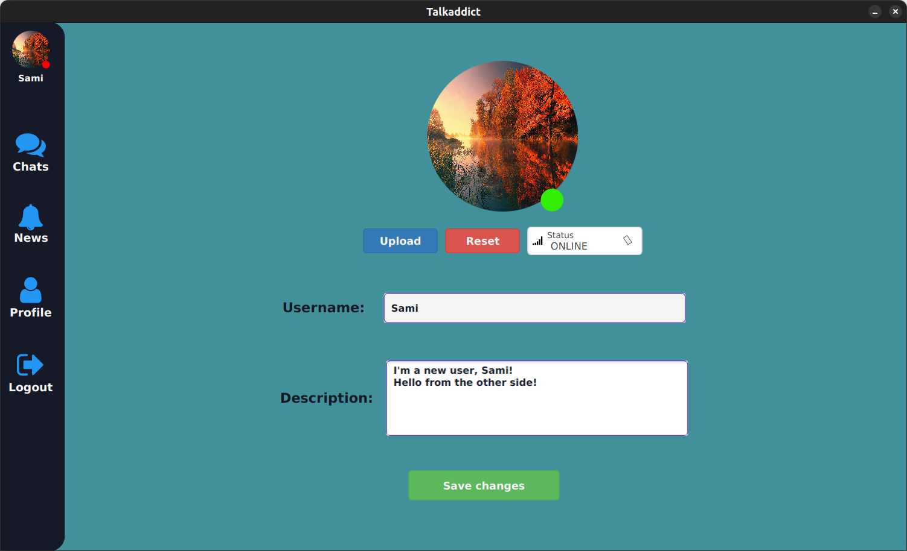
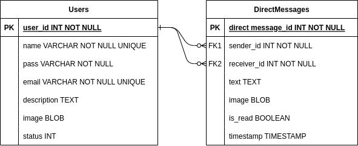

# Talkaddict Documentation - JavaFx desktop chat application

## Content
* [General Functionality Overview](#general-functionality-overview)
* [Packages and Tools Overview](#packages-and-tools-overview)
* [Architectural Design Patterns involved - DDD Architecture](#architectural-design-patterns-involved)
* [Presentation Layer](#presentation-layer)
  * [Overview](#overview-)
  * [Case Study - FXML Binding Properties](#fxml-binding-properties-)
* [Application Layer](#application-layer)
  * [Overview](#overview--1)
  * [Case Study - CQRS using the mediator from the Pipelinr package](#cqrs-using-pipelinr-)
* [Domain Layer](#domain-layer)
  * [Overview](#overview--2)
  * [Case Study - ERD](#erd-)
* [Infrastructure Layer](#infrastructure-layer)
  * [Overview](#overview--3)
  * [Case Study - ORMLite](#ormlite-)

## General Functionality Overview

Welcome to Talkaddict - the ultimate JavaFx desktop chat application that allows you to connect with friends and colleagues in real-time. With Talkaddict, you can easily login or register to start chatting with other users.


Our user-friendly interface allows you to see a list of all users, and filter them by name to find exactly who you're looking for. You can also easily edit your profile, including options to change your avatar, username, bio, and activity status (online, offline, busy, away).



In addition, Talkaddict allows you to have conversations with different users, with options for sending text, images, or a combination of both. You can even delete messages or view the entire history of a conversation.


With Talkaddict, staying connected with the people you care about has never been easier. So why wait? Start chatting today with Talkaddict!

## Packages and Tools Overview

Tools and platforms involved during the development process:
- **Java JDK19 and JavaFx 19**
- **Git and GitHub** for VCS and source code hosting
- **SceneBuilder** for creating the FXML Layouts
- **Intellij IDEA Ultimate** as IDE
- **Sqlite** as database storage
- **Maven** as package manager

Java Packages used:
- **BootstrapFx** and **MaterialFx** for UI components and stylesheets
- **FontawesomeFx** for icons
- **BCrypt** for password hashing
- **ValidatorFx** for form validation rules
- **ORMLite** as Sqlite ORM
- **Pipelinr** as Mediator for CQRS
- **Result** for functional programming types and monads such as Option, Result, Either, etc.

## Architectural Design Patterns Involved

Talkaddict’s architecture resembles certain features inherited from the DDD (Domain Driven Design) Architecture, including the folder structure separated into presentation (FXML Layouts), application (controllers, view models, use cases), domain (entities, interfaces, custom exceptions) and infrastructure (daos/repositories, type converters, managers for db, io and JavaFx related stuff) layers.


### DDD Overview:

Domain-Driven Design (DDD) is an approach to software development that focuses on modeling the business domain of the application, with the goal of improving communication and collaboration between software developers and domain experts.

DDD divides the application into distinct layers, each of which has a specific role and purpose. Here's a brief overview of the layers in a DDD system:
- **Domain Layer**: This is the core business logic of the application, and represents the key concepts and ideas that the application is designed to support. It includes the Entities, Value Objects, Services, and Repositories that represent the business domain.

- **Application Layer**: This layer represents the interface between the Domain Layer and the outside world. It includes Application Services, which define the use cases and business rules of the application, and rely on the Domain Layer to implement them. It also includes Adapters, which provide a consistent interface for the Application Services to interact with external systems (e.g. databases, web services).

- **Infrastructure Layer**: This layer represents the technical infrastructure of the application, including things like databases, web servers, message queues, app frontends, and so on. It includes implementations of the Repositories defined in the Domain Layer, as well as other technical components needed to support the operation of the application.


## Presentation Layer

### Overview:
Talkaddict’s Presentation Layer consists of the FXML layouts, components and CSS styles used by JavaFx to define the UI of an application. Every FXML layout/view is mapped against a specific Controller defined in the Application Layer in order to handle the functionality associated with the widgets using the so called Binding Properties which we will have a look at in a next section.

Now, let’s take a look at the main pages and widgets used by Talkaddict:
- **Splash-View** - the first layout shell that is inflated when the app is launched;
  - **Login-Pane** - the login form widget is inflated in a sliding pane widget defined on the Splash-View shell;
  - **Register-Pane** - similar with the Login-Pane;
- **Home-View** - the layout shell that is inflated after the user has been successfully authenticated and presents a side-bar menu for switching between pages;
  - **Profile-Pane** - the update profile widget which consists in a bunch of form fields that allows the user to edit different attributes of his/her profile including the username, the bio, the avatar or the activity status;
  - **Chat-Pane** - the actual chat pane widget which consists in the two main ListViews for Users and Messages, the send message, the chat header and the search user widgets;


### FXML Binding Properties:

In JavaFx, a binding property is a special type of property that is bound to another property, such that the value of the binding property automatically reflects the value of the other property. When the value of the other property changes, the value of the binding property is automatically updated to reflect the change.

Binding properties are useful because they allow you to create a relationship between two properties, such that changes to one property are automatically reflected in the other. This can be helpful for keeping different parts of your application in sync, or for reacting to changes in one part of the application by updating another part.

For example, in the example given below extracted from the RegisterController, a unidirectional binding is defined between the username StringProperty from the user ViewModel and the TextProperty associated with the username TextField which means that the value inside the user ViewModel’s username property is updated whenever the value of the username FXML TextField is changed but not vice versa. The latter becomes an Observable whereas the former becomes an Observer which subscribes to the FXML field, as stated by the Observer Design Pattern.

```java
private void bindViewModelToFields() {
    _userViewModel.usernameProperty().bind(_usernameField.textProperty());
    _userViewModel.emailProperty().bind(_emailField.textProperty());
    _userViewModel.passwordProperty().bind(_passwordField.textProperty());
}
```

## Application Layer

### Overview:

Talkaddict’s Application Layer consists of the JavaFx controllers for attaching functionality to the FXML views (and exception handling), cell factories for defining custom widgets for ListViews and other panes, view models for persisting the state of the widgets and use cases (atomic blocks of related functionalities) defined as commands and queries with respect to the CQRS pattern and the Pipeline Package (explained in a next section too).

List of Controllers:
* **ChatController** - associated with the ChatPane and holding logic for searching users, sending messages, watching messages, etc.;
* **HomeController** - associated with the HomeView and holding logic for switching between profile and chat pages;
* **LoginController** - associated with the LoginPane and holding logic for user login;
* **ProfileController** - associated with the ProfilePane and holding logic for user profile editing;
* **RegisterController** - associated with the RegisterPane and holding logic for user registration;
* **SplashController** - associated with the SplashView and holding logic for switching between login and register pages;

### CQRS using Pipelinr:

The Command Query Responsibility Segregation (CQRS) pattern is a software architecture pattern that separates the responsibilities of reading and writing data into separate objects or components. In a CQRS system, the "write" side of the application (also known as the "command" side) is responsible for creating, updating, and deleting data, while the "read" side (also known as the "query" side) is responsible for reading and presenting data to the user.

The CQRS pattern is often used in conjunction with the Mediator pattern, which is a behavioral design pattern that allows multiple objects or components to communicate with each other through a mediator object, rather than communicating directly with each other. The mediator object acts as a "middleman" between the different objects, and helps to decouple them from each other, making it easier to modify or extend the system.

In Talkaddict’s CQRS system, the mediator from the Pipeline is defined using the Pipeline class and its send() method which intercepts the incoming requests, splits them between queries and commands and matches every single one against its corresponding UseCase/Handler, as we can see in the examples below extracted from the GetDirectMessagesByLoggedInUserAndOtherUser query:

```java
// mediator send request
_mediator.send(new GetDirectMessagesByLoggedInUserAndOtherUser.Query(
        _directMessagesListViewModel,
        _loggedInUserViewModel.idProperty().get(),
        _selectedUserViewModel.idProperty().get()
        ));


// request class
public class GetDirectMessagesByLoggedInUserAndOtherUser {
    public record Query(
            DirectMessageListViewModel dto,
            int loggedInUserId,
            int otherUserId
    ) implements an.awesome.pipelinr.Command<Result<ObservableList<DirectMessageFx>, Exception>> {
    }

    public static class Handler implements an.awesome.pipelinr.Command.Handler<Query, Result<ObservableList<DirectMessageFx>, Exception>> {
        private final Logger _logger;

        public Handler(Logger logger) {
            _logger = logger;
        }

        @Override
        public Result<ObservableList<DirectMessageFx>, Exception> handle(Query query) {
            _logger.info("GetDirectMessagesByLoggedInUserAndOther Use Case invoked");
            var loggedInUserId = query.loggedInUserId;
            var otherUserId = query.otherUserId;
            var dto = query.dto;

            try {
                dto.initDirectMessagesByReceiverIdAndSenderIdAndViceVersa(loggedInUserId, otherUserId);
            } catch (Exception ex) {
                _logger.error(ex.toString());
                return Result.err(ex);
            }

            return Result.ok(dto.directMessagesProperty().get());
        }
    }
}
```

## Domain Layer

### Overview:

Talkaddict’s Domain Layer consists of the User and DirectMessage Entities and the GenericDao interface used by the DI container to register repositories.

### ERD:



## Infrastructure Layer

### Overview:

Talkaddict’s Infrastructure Layer consists of the Repositories associated with the User and DirectMessage Entities (UserDao and DirectMessageDao), the Type Converters/Mappers used to convert user/message raw entities into view models and vice versa (UserConverter and DirectMessageConverter) and a bunch of useful managers, including:
* **DatabaseManager** - sqlite db connection manager;
* **DotenvManager** - for reading .env variables from the config file;
* **ImageManager** - for converting byte arrays to images, selecting image files from device, creating avatar custom widgets and many more;
* **PasswordManager** - for hashing and verifying passwords;
* **PreferencesManager** - for persisting useful data using SharedPreferences (logged in user ID in our case);
* **SceneFxManager** - for switching between scenes, loading panes, showing alerts and many more;

### ORMLite:

An Object-Relational Mapping (ORM) is a software tool that allows a programmer to work with a database using objects, rather than using SQL statements. ORMs are designed to bridge the gap between the object-oriented programming model and the relational database model, and make it easier for programmers to work with databases in an object-oriented way.

ORMs work by creating a mapping between the objects in the programming language and the rows in the database. This mapping allows the programmer to use objects to create, read, update, and delete rows in the database, without having to write any SQL statements. The ORM handles the details of translating the object-oriented operations into SQL statements, and executing those statements against the database.

Some popular ORMs for Java include Hibernate, EclipseLink, Apache OpenJPA and ORMLite.

ORMLite uses Java Annotations to help the developers implement the Code-First approach and instruct the Sqlite to generate the proper tables associated with the Java POJO classes:

```java
@DatabaseTable(tableName = "user")
public class User implements BaseEntity {
    @DatabaseField(generatedId = true, allowGeneratedIdInsert = true)
    private Integer id;

    @DatabaseField(columnName = "name", canBeNull = false, unique = true)
    private String username;

    @DatabaseField(columnName = "pass", canBeNull = false)
    private String password;

    @DatabaseField(canBeNull = false, unique = true)
    private String email;

    @DatabaseField(dataType = DataType.LONG_STRING)
    private String description;

    @DatabaseField(columnName = "image", dataType = DataType.BYTE_ARRAY)
    private byte[] avatar;

    @DatabaseField(canBeNull = false, dataType = DataType.ENUM_INTEGER)
    private UserStatus status;

    @ForeignCollectionField(columnName = "sender_id", orderColumnName = "timestamp")
    private ForeignCollection<DirectMessage> sentMessages;

    @ForeignCollectionField(columnName = "receiver_id", orderColumnName = "timestamp")
    private ForeignCollection<DirectMessage> receivedMessages;
}
```

Also, using the ORMLite DaoFactory, we can easily instruct the ORM to write SQL queries for us using Java syntax inside our custom DAOs (Repositories) as so:
```java
@Override
public synchronized void createOrUpdate(User entity) throws ApplicationException {
    try {
        _dao.createOrUpdate(entity);
        _logger.info("User created or updated with email: " + entity.getEmail());
    } catch (SQLException ex) {
        _logger.error(ex, "Error creating or updating user: " + ex.getMessage(), ex.getStackTrace());
        throw new ApplicationException("Error creating or updating user: " + ex.getMessage());
    } finally {
        _databaseManager.closeConnectionSource();
    }
}
```